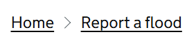

# Breadcrumbs

Render GOV.UK Design System styled breadcrumbs that are defined per page and rendered in the layout using Blazor Sections.

## Example image



## How it works

- Each page declares its breadcrumbs by rendering `GdsBreadcrumbs` component.
- Your layout file includes a `SectionOutlet` with the name `Layout.GdsBreadcrumbs` to render the breadcrumbs in the place you choose.
- Each breadcrumb is created with the custom `GdsBreadcrumb` structure.`
- Each breadcrumb consists of a Uri and a Label.

## Example for your layout file (e.g., `MainLayout.razor`)

```
@using Microsoft.AspNetCore.Components.Sections

<div class="govuk-width-container">
    <SectionOutlet SectionName="Layout.GdsBreadcrumbs" />

    <main class="govuk-main-wrapper govuk-body" id="main-content" role="main">
        @Body
    </main>
</div>

```

## Example for your page

On any page that needs breadcrumbs, render the component and provide your breacrumbs collection:
```
<GdsBreadcrumbs Items="@Breadcrumbs" />
```
This example shows how to define the `Breadcrumbs` collection in your page's code:
```
public IReadOnlyCollection<GdsBreadcrumb> Breadcrumbs { get; set; } = [
    new GdsBreadcrumb("" "Home"),
    new GdsBreadcrumb("floodreport" "Report a flood"),
    new GdsBreadcrumb("floodreport/update" "Update flood report"),
];
```