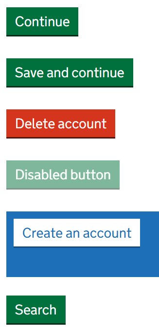

# Button

Render a GOV.UK Design System styled button that can be used to submit forms or trigger actions.

## Example image



## How it works

- Renders a `<button>` element.
- The `Text` parameter sets the button text content.
- The default is a submit button, but you can set `IsSubmit` to `false` to render a regular button.
- The `OnClick` event is only used if you select `IsSubmit` to `false`.
- The default class is `govuk-button`, but you can use `AdditionalCssClasses` to style the button.
- You can also pass additional HTML attributes, such as `style`, to this component.
- The `PreventDoubleClick` parameter adds `data-prevent-double-click` to prevent multiple submissions.

## Simple example (Continue button)

```csharp
<GdsButton />
```

## Other Examples

```csharp
<GdsButton Text="Save and continue" />
```

```csharp
<GdsButton AdditionalCssClasses="govuk-button--warning" Text="Delete account" />
```

```csharp
<GdsButton disabled aria-disabled="true" Text="Disabled button" />
```

```csharp
<GdsButton AdditionalCssClasses="govuk-button--inverse" Text="Create an account" />
```

```csharp
<GdsButton IsSubmit="false" OnClick="@somefunction" Text="Search" />
```

## Notes

- Please use GdsStartButton for the specific start button as shown on the GOV.UK Design System website.
