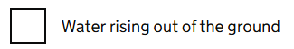

# Checkbox

Render a single GOV.UK Design System styled checkbox using the option from [GdsOptionItem<T>](GdsOptionItem.md).

## Example image



## How it works

- Renders a ```<div class="govuk-checkboxes__item">``` with associated label, check box and optional hint.
- Supports binding to any value type (e.g., string, int, enum, bool, custom types).
- Can be used standalone or as part of a group for multiple selections.
- If the [GdsOptionItem](GdsOptionItem.md) includes a hint, it is displayed below the label as defined by the GOV.UK Design System style.
- The component integrates with Blazor's validation system, but the errors won't be displayed in this component. See [GdsCheckboxes](Checkboxes.md) which shows check box error messages are shown above the check boxes using [GdsErrorMessage](ErrorMessage.md).
- The component renders the check boxes using Blazor's `InputCheckbox` component, labels via the [GdsLabel](Label.md) component, and hints via the [GdsHint](Hint.md) component.
- You _can_ include a `Name` parameter to ensure the check box is grouped correctly when used in a group context. If ommitted, a unique name will be generated.

## Simple example

```csharp
// id, label, T value, selected = false, isExclusive = false, hint = default
var option = new GdsOptionItem<bool>("subscribe", "Subscribe to newsletter", hint: "Receive updates and offers via email");
<GdsCheckbox Option="@option" />
```

## Recommended use example

In most cases you will want something more than a single check box, so we recomend you using [GdsCheckboxes component](Checkboxes.md). Doing this also guarantees good HTML and accessibility.

Please refer to that component for full examples.