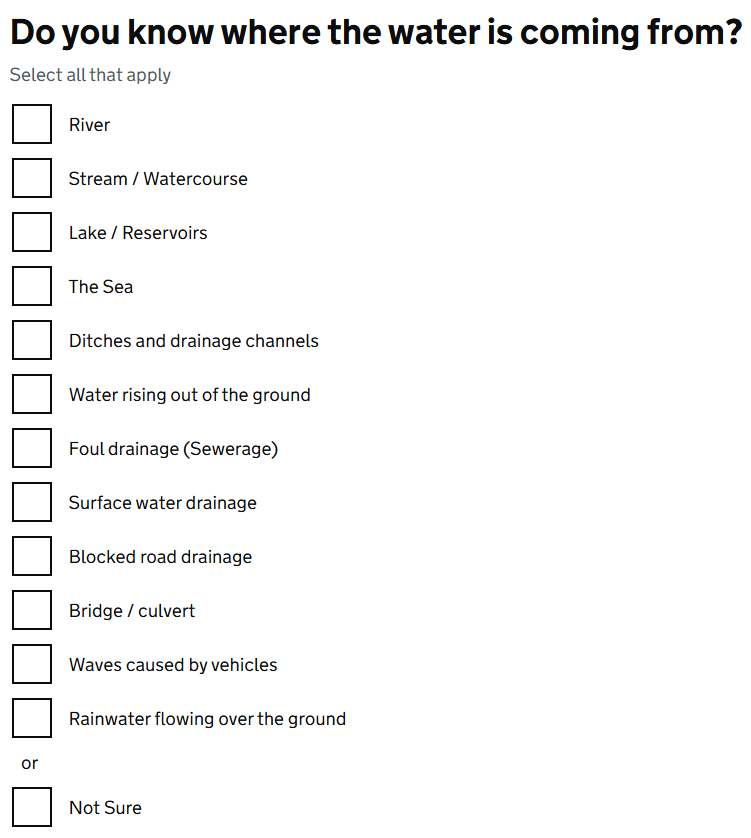

# Checkboxes

Render GOV.UK Design System styled checkboxes using the options from a list of [GdsOptionItem<T>](GdsOptionItem.md). This component supports any type of value and can be used for single or multiple selections.

## Example image



## How it works

- Renders a list of [GdsOptionItem](GdsOptionItem.md) under a ```<div class="govuk-checkboxes" data-module="govuk-checkboxes">```.
- Supports binding to any value type (e.g., string, int, enum, bool, custom types).
- It is recommended to use this component within a [GdsFormGroup](FormGroup.md), Blazor's `InputRadioGroup`, and [GdsFieldsetGroup](FieldsetGroup.md) to fully support correct HTML and accessibility.

## Simple example

```
ICollection<GdsOptionItem<int>> contactTypes = [
    new ("contactTypePhone", "Phone", 1),
    new ("contactTypeEmail", "Email", 2),
    new ("contactTypeText", "Text message", 3),
    new ("contactTypePost", "Post", 4),
];
<GdsCheckboxes Options="@contactTypes" />
```

## Smaller checkboxes example

```
ICollection<GdsOptionItem<int>> contactTypes = [
    new ("contactTypePhone", "Phone", 1),
    new ("contactTypeEmail", "Email", 2),
    new ("contactTypeText", "Text message", 3),
    new ("contactTypePost", "Post", 4),
];
<GdsCheckboxes Options="@contactTypes" Smaller="true" />
```

## Recommended use example

```
ICollection<GdsOptionItem<int>> contactTypes = [
    new ("contactTypePhone", "Phone", 1),
    new ("contactTypeEmail", "Email", 2),
    new ("contactTypeText", "Text message", 3),
    new ("contactTypePost", "Post", 4),
];
<GdsFormGroup For="() => Model.ContactType">
    <InputRadioGroup @bind-Value="Model.ContactType">
        <GdsFieldsetGroup>
            <Heading>
                <h2 class="govuk-fieldset__heading">How can we contact you?</h2>
            </Heading>
            <Content>
                <GdsHint>Select all that apply.</GdsHint>
                <GdsErrorMessage />
                <GdsRadios Options="@contactTypes" />
            </Content>
        </GdsFieldsetGroup>
    </InputRadioGroup>
</GdsFormGroup>
```

# Custom example using GDS conditional controls

```
ICollection<GdsOptionItem<int>> contactTypes = [
    new ("contactTypePhone", "Phone", 1),
    new ("contactTypeEmail", "Email", 2),
    new ("contactTypeText", "Text message", 3),
    new ("contactTypePost", "Post", 4),
];
<GdsFormGroup For="() => Model.ContactType">
    <InputRadioGroup @bind-Value="Model.ContactType">
        <GdsFieldsetGroup>
            <Heading>
                <h2 class="govuk-fieldset__heading">How can we contact you?</h2>
            </Heading>
            <Content>
                <GdsHint>Select all that apply.</GdsHint>
                <GdsErrorMessage />
                <div class="govuk-checkboxes" data-module="govuk-checkboxes">
                    @foreach (var option in contactTypes)
                    {
                        var conditionalId = option.Value == 1 ? $"{option.Id}-conditional" : null;
                        <GdsCheckbox Option="@option" ConditionalId="@conditionalId" />
                        if (option.Value == 1)
                        {
                            <div class="govuk-checkboxes__conditional govuk-checkboxes__conditional--hidden" id="@conditionalId">
                                <GdsFormGroup For="() => Model.PhoneNumber">
                                    <GdsLabel Text="What is your phone number?" />
                                    <GdsErrorMessage />
                                    <GdsInputText @bind-Value=Model.PhoneNumber class="govuk-input govuk-input--width-50" />
                                </GdsFormGroup>
                            </div>
                        }
                    }
                </div>
            </Content>
        </GdsFieldsetGroup>
    </InputRadioGroup>
</GdsFormGroup>
```