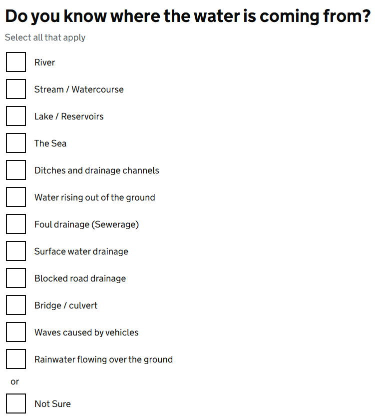

# Checkboxes

Render GOV.UK Design System styled checkboxes.

## Example image



## How it works

- Renders a `<div class="govuk-checkboxes" data-module="govuk-checkboxes">` element.
- `For` optional expression parameter to associate the checkboxes with a model property.
  Helps with default checkbox names, keeping all `GdsInputCheckbox` errors related to the `GdsCheckboxes` and with accessibility.
- `Smaller` optional parameter to render smaller checkboxes.

Refer to [GdsInputCheckbox](InputCheckbox.md) for more details on how to use the `GdsInputCheckbox` component.

## Notes

Binding to Blazor's `InputCheckbox` value means binding to a bool.
This works well for simple or manual checkboxes, but in more real examples this makes binding more difficult where your real data is likely to be from an Enum or list of items from your database.
Meaning your real data is unlikely to use bools, but would use int's and Guid's.

This is long standing Blazor challenge with checkboxes, but some of the examples below try to demonstrate ways you can bind to bools and also keep your model up to date.
Binding to a dictionary and using the `GdsInputCheckbox` components' OnChanged parameter.

## Examples

### Manual checkboxes example

```razor
<GdsFormGroup>
    <GdsFieldsetGroup>
        <GdsFieldsetLegend>
            <GdsFieldsetHeading Level="2">What is your nationality?</GdsFieldsetHeading>
        </GdsFieldsetLegend>

        <GdsHint>If you have dual nationality, select all options that are relevant to you</GdsHint>
        <GdsErrorMessage />

        <GdsCheckboxes>
            <GdsCheckboxItem>
                <GdsInputCheckbox @bind-Value="model.IsBritish" />
                <GdsCheckboxLabel Text="British" />
                <GdsCheckboxHint>including English, Scottish, Welsh and Northern Irish</GdsCheckboxHint>
            </GdsCheckboxItem>
            <GdsCheckboxItem>
                <GdsInputCheckbox @bind-Value="model.IsIrish" />
                <GdsCheckboxLabel Text="Irish" />
            </GdsCheckboxItem>
            <GdsCheckboxItem>
                <GdsInputCheckbox @bind-Value="model.IsOther" />
                <GdsCheckboxLabel Text="Citizen of another country" />
            </GdsCheckboxItem>
        </GdsCheckboxes>
    </GdsFieldsetGroup>
</GdsFormGroup>

@code {
    public class CheckboxesModel
    {
        [GdsFieldErrorClass(GdsFieldTypes.Checkbox)]
        public bool IsBritish { get; set; }

        [GdsFieldErrorClass(GdsFieldTypes.Checkbox)]
        public bool IsIrish { get; set; }

        [GdsFieldErrorClass(GdsFieldTypes.Checkbox)]
        public bool IsOther { get; set; }
    }
}
```

### Checkboxes from list example

```razor
<GdsFormGroup>
    <GdsFieldsetGroup>
        <GdsFieldsetLegend>
            <GdsFieldsetHeading Level="2">Which types of waste do you transport?</GdsFieldsetHeading>
        </GdsFieldsetLegend>

        <GdsHint>Select all that apply</GdsHint>
        <GdsErrorMessage />

        <GdsCheckboxes For="() => model.Waste">
            @foreach ((Guid wasteId, string wasteLabel) in wasteTypesFromDatabase)
            {
                bool isOther = wasteId == OtherWasteTypeId;
                string key = wasteId.ToString("N");

                if (isOther)
                {
                    <GdsCheckboxDivider />

                    <GdsCheckboxItem>
                        <GdsInputCheckbox @bind-Value="@SelectedWasteTypes[key]" OnChanged="isChecked => OnWasteTypeChanged(isChecked, wasteId)" Exclusive />
                        <GdsCheckboxLabel Text="@wasteLabel" />
                        <GdsCheckboxHint>other type of waste which is not listed</GdsCheckboxHint>
                    </GdsCheckboxItem>
                }
                else
                {
                    <GdsCheckboxItem>
                        <GdsInputCheckbox @bind-Value="@SelectedWasteTypes[key]" OnChanged="isChecked => OnWasteTypeChanged(isChecked, wasteId)" />
                        <GdsCheckboxLabel Text="@wasteLabel" />
                    </GdsCheckboxItem>
                }
            }
        </GdsCheckboxes>
    </GdsFieldsetGroup>
</GdsFormGroup>

@code {
    private CheckboxesModel model = new();
    private EditContext? editContext;

    // pretend database table of waste types, with Id and Label
    private readonly static Guid OtherWasteTypeId = Guid.NewGuid();
    private record WasteType(Guid Id, string Label);
    private List<WasteType> wasteTypesFromDatabase = [
        new(Guid.NewGuid(), "Waste from animal carcasses"),
        new(Guid.NewGuid(), "Waste from mines or quarries"),
        new(Guid.NewGuid(), "Farm or agricultural waste"),
        new(OtherWasteTypeId, "Other"),
    ];

    // can't use <Enum, bool> or <Guid, bool> if it binds to InputCheckbox Value. Blazor throws errors.
    private Dictionary<string, bool> SelectedWasteTypes = [];

    protected override void OnInitialized()
    {
        if (editContext is null)
        {
            editContext = new(model);
            editContext.SetFieldCssClassProvider(new GdsFieldCssClassProvider());
        }

        // set up the selected waste types (string, bool dictionary)
        SelectedWasteTypes = wasteTypesFromDatabase.ToDictionary(o => o.Id.ToString("N"), _ => false);
    }

    private void OnWasteTypeChanged(bool isChecked, Guid wasteId)
    {
        // update the model using the selected waste
        if (isChecked)
        {
            if (!model.Waste.Contains(wasteId))
            {
                model.Waste.Add(wasteId);
            }
        }
        else
        {
            model.Waste.Remove(wasteId);
        }
    }

    public class CheckboxesModel
    {
        [Required]
        [MinLength(1, ErrorMessage = "Select types of waste transported, or select 'Other'")]
        [GdsFieldErrorClass(GdsFieldTypes.Checkbox)]
        public List<Guid> Waste { get; set; } = [];
    }
}
```

### Checkboxes from Enum, and conditional email example

```razor
<GdsFormGroup>
    <GdsFieldsetGroup>
        <GdsFieldsetLegend>
            <GdsFieldsetHeading Level="2">How would you like to be contacted?</GdsFieldsetHeading>
        </GdsFieldsetLegend>

        <GdsHint>Select all options that are relevant to you</GdsHint>
        <GdsErrorMessage />

        <GdsCheckboxes For="() => model.ContactPreferences">
            @foreach (ContactPreferencesEnum contactPreference in Enum.GetValues<ContactPreferencesEnum>())
            {
                int key = (int)contactPreference;
                    
                if (contactPreference == ContactPreferencesEnum.Email)
                {
                    <GdsCheckboxItem>
                        <GdsInputCheckbox @bind-Value="@SelectedContactPreferences[key]" OnChanged="isChecked => OnContactPreferencesChanged(isChecked, contactPreference)" ConditionalId="conditional-email" />
                        <GdsCheckboxLabel Text="@contactPreference.ToString()" />
                    </GdsCheckboxItem>
                    <GdsCheckboxConditional Id="conditional-email">
                        <GdsFormGroup>
                            <GdsLabel Text="Email address" />
                            <GdsErrorMessage />
                            <GdsInputText @bind-Value="@model.EmailAddress" type="email" spellcheck="false" autocomplete="email" class="govuk-input govuk-!-width-one-third" />
                        </GdsFormGroup>
                    </GdsCheckboxConditional>
                }
                else
                {
                    <GdsCheckboxItem>
                        <GdsInputCheckbox @bind-Value="@SelectedContactPreferences[key]" OnChanged="isChecked => OnContactPreferencesChanged(isChecked, contactPreference)" />
                        <GdsCheckboxLabel Text="@contactPreference.ToString()" />
                    </GdsCheckboxItem>
                }
            }
        </GdsCheckboxes>
    </GdsFieldsetGroup>
</GdsFormGroup>

@code {
    private CheckboxesModel model = new();
    private EditContext? editContext;

    // can't use <Enum, bool> or <Guid, bool> if it binds to InputCheckbox Value. Blazor throws errors.
    private Dictionary<int, bool> SelectedContactPreferences { get; set; } = [];

    public enum ContactPreferencesEnum
    {
        Email,
        Phone,
        Text,
    }

    private void OnContactPreferencesChanged(bool isChecked, ContactPreferencesEnum contactPreference)
    {
        // update the model using the selected contact preference
        if (isChecked)
        {
            if (!model.ContactPreferences.Contains(contactPreference))
            {
                model.ContactPreferences.Add(contactPreference);
            }
        }
        else
        {
            model.ContactPreferences.Remove(contactPreference);
        }
    }

    public class CheckboxesModel
    {
        [Required]
        [MinLength(1, ErrorMessage = "Select how you would like to be contacted")]
        [GdsFieldErrorClass(GdsFieldTypes.Checkbox)]
        public List<ContactPreferencesEnum> ContactPreferences { get; set; } = [];

        [Required(ErrorMessage = "Enter your email address")]
        [EmailAddress(ErrorMessage = "Enter a valid email address")]
        [GdsFieldErrorClass(GdsFieldTypes.Input)]
        public string? EmailAddress { get; set; }
    }
}
```