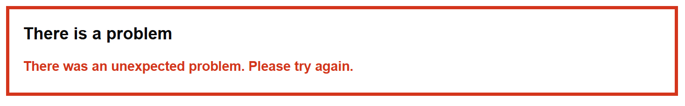
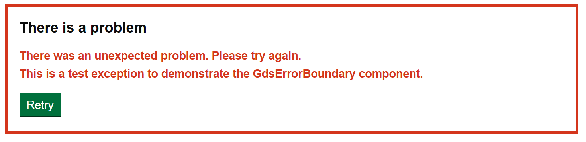

# Error Boundary

Render a GOV.UK Design System styled Blazor error boundary.

# Example images




## How it works

- Wraps a Blazor `ErrorBoundary` component.
- Showing a GOV.UK Design System styled error summary.
- `ShowErrorMessage` optional parameter to show the error message.
- `ShowHelpLink` optional parameter to show a help link, if there is a link.
- `ShowRetryButton` optional parameter to show a retry button.

# Example

```csharp
<GdsContainer>
    <GdsMainWrapper id="main-content" AdditionalCssClasses="govuk-body">
        @if (Env.IsProduction())
        {
            <GdsErrorBoundary>
                @Body
            </GdsErrorBoundary>
        }
        else
        {
            <GdsErrorBoundary ShowErrorMessage ShowHelpLink ShowRetryButton>
                @Body
            </GdsErrorBoundary>
        }
    </GdsMainWrapper>
</GdsContainer>

@code {
    [Inject]
    private IWebHostEnvironment Env { get; set; } = default!;
}
```
