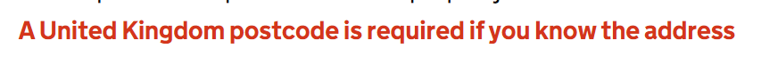

# Error Message

Render a GOV.UK Design System styled error message that associates with a form control. Works standalone (explicit `id`) or by consuming a cascaded control id provided by `GdsFormGroup`.

## Example image



## How it works

- Renders `<p class="govuk-error-message">`.
- The `id` attribute is set from the `Id` component property. If omitted, it falls back to a cascaded id provided by `GdsFormGroup`.

## Notes

You never manually set the error message text. It is automatically populated from the Blazor validation system when there are validation errors for the associated field.

## Simple example with explicit `id`

```csharp
<GdsErrorMessage Id="eventName" />
<InputText id="eventName" class="govuk-input" @bind-Value="eventName" />
```

## Example using a cascaded id

```csharp
<GdsFormGroup For="() => Model.EventName">
    <GdsLabel Text="What is the name of the event?" />
    <GdsHint>The name you'll use on promotional material</GdsHint>
    <GdsErrorMessage />
    <GdsInputText @bind-Value=Model.EventName class="govuk-input govuk-input--width-50" />
</GdsFormGroup>
```