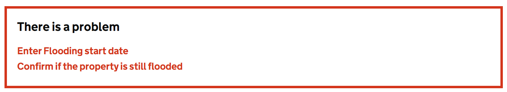

# Error Summary

Render a GOV.UK Design System styled summary of validation errors for a form. This component displays a list of validation errors.

## Example image



## How it works

- Renders `<div class="govuk-error-summary"><div role="alert">` containing a summary of validation errors.
- The error messages are shown from the Blazor validation system when there are validation errors in the form.

## Example

```
<EditForm EditContext="_editContext" OnSubmit="OnSubmit" FormName="MyForm">
    <GdsErrorSummary />
</EditForm>
```