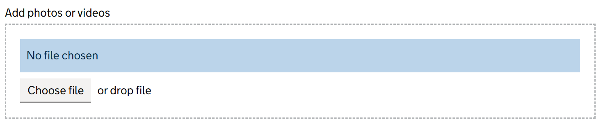

# File Input

Render a GOV.UK Design System styled file input that allows users to upload one or more files.

You can use this component to handle file uploads in your forms, with support for busy state and event callbacks.

## Example image



## How it works

- Renders `<input type="file" class="govuk-file-upload">` inside a GOV.UK styled drop zone.
- The `IsBusy` parameter disables the input when set to `true`.
- The `OnFilesSubmitted` event callback is triggered when files are selected.

## Simple example

```csharp
<GdsFileInput OnFilesSubmitted="HandleFiles" />
```

## Example

```csharp
<GdsFormGroup For="() => Model.SupportingDocuments">
    <GdsLabel Text="Upload supporting documents" />
    <GdsHint>Accepted file types: PDF, DOCX, JPG</GdsHint>
    <GdsErrorMessage />
    GdsFileInput OnFilesSubmitted="HandleFiles" />
</GdsFormGroup>
```

## Notes

- The component supports selecting up to 50 files.
