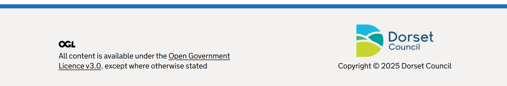

# Footer

Render a GOV.UK Design System styled footer.

Allowing you to use your own content in the footer, via the GDS `Navigation` and `Meta` sections.

## Example image



## How it works

- Renders a ```<footer class="govuk-footer">``` element.
- Supports flexible `Navigation` and `Meta` optional sections.
- The navigation section typically uses columns of links with `govuk-footer__section` and `govuk-footer__list`.
- The meta section supports multiple types of meta items with `govuk-footer__meta-item` examples include:
  - open government licence
  - support links with `govuk-footer__list`
  - images and copyright message.
- The utility class `.govuk-footer__meta-item--grow` can be used to make a meta item expand to fill available space.

Full examples from the GOV.UK Design System can be at [Footer with links and secondary navigation](https://design-system.service.gov.uk/components/footer/#footer-with-links-and-secondary-navigation).

## Example - Simple image and copyright

```csharp
<GdsFooter>
    <Meta>
        <div class="govuk-footer__meta-item govuk-footer__meta-item--grow">
            <a class="govuk-footer__link govuk-link-image" href="https://www.google.co.uk" title="Go to your site">
                
            </a>
        </div>
        <div class="govuk-footer__meta-item">
            <div>Copyright &copy; @(DateTimeOffset.UtcNow.Year) Your company</div>
        </div>
    </Meta>
</GdsFooter>
```