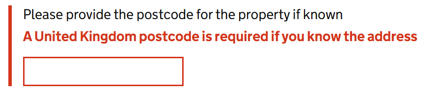

# Form Group

Render a GOV.UK Design System styled form group that contains a GDS form control.

## Example image



## How it works

- Renders `<div class="govuk-form-group">` with any child content you provide.
- Applies error styling automatically if the associated field is invalid.
- The field's `Id` is either calculated for the field or manually set via the `Id` parameter and cascaded down to any child components.
- The `FieldIdentifier` is automatically determined from the `For` parameter and cascaded down to child components.`
- `DataModule` and `DataAttributes` parameters allow you to create `InputTextArea` to work as a GDS [Character Count](https://design-system.service.gov.uk/components/character-count/).
- Supports additional CSS classes via the `AdditionalCssClasses` parameter.
- It is recommended to use this component to wrap all GDS form controls, hints, error messages, and labels to ensure correct HTML structure and accessibility.

## Simple example

```
<GdsFormGroup For="() => Model.PhoneNumber">
    <GdsLabel Text="What is your phone number?" />
    <GdsHint>For international numbers include the country code</GdsHint>
    <GdsErrorMessage />
    <GdsInputText @bind-Value=Model.PhoneNumber class="govuk-input govuk-input--width-50" />
</GdsFormGroup>
```

## Manual ID's and Blazor control example

```
<GdsFormGroup For="() => Model.PhoneNumber" Id="phone-number">
    <GdsLabel Text="What is your phone number?" />
    <GdsHint>For international numbers include the country code</GdsHint>
    <GdsErrorMessage />
    <InputText id="phone-number" @bind-Value=Model.PhoneNumber class="govuk-input govuk-input--width-50" aria-describedby="phone-number-hint phone-number-error" />
</GdsFormGroup>
```

The ID of `phone-number` on the `GdsFormGroup` is cascaded down to:
- `GdsHint` being phone-number-hint there
- `GdsErrorMessage` being phone-number-error there

## Character count example

```
<GdsFormGroup For="() => Model.OtherAction" AdditionalCssClasses="govuk-character-count govuk-!-margin-top-4" DataModule="govuk-character-count" DataMaxLength="100">
    <h2 class="govuk-label-wrapper">
        <GdsLabel Text="Can you provide more details?" AdditionalCssClasses="govuk-label--m" />
    </h2>
    <GdsHint>Do not include personal or financial information</GdsHint>
    <GdsErrorMessage />
    <InputTextArea id="@nameof(Model.OtherAction)" @bind-Value="Model.OtherAction" class="govuk-textarea govuk-js-character-count" rows="5" />
    <div id="@($"{nameof(Model.OtherAction)}-info")" class="govuk-hint govuk-character-count__message">You can enter up to 100 characters</div>
</GdsFormGroup>
```

## Specific examples

- [Check boxes example](Checkboxes.md)
- [Error message example](ErrorMessage.md)
- [File input example](FileInput.md)
- [Hint example](Hint.md)
- [Input number example](InputNumber.md)
- [Input date example](InputDate.md)
- [Input partial date example](InputPartialDate.md)
- [Input text example](InputText.md)
- [Label example](Label.md)
- [Radio buttons example](Radios.md)
