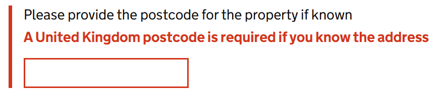

# Form Group

Render a GOV.UK Design System styled form group that contains a GDS form control.

## Example image



## How it works

- Renders `<div class="govuk-form-group">` with any child content you provide.
- Applies error styling automatically if the associated field is invalid.
- `DataModule` and `DataAttributes` parameters allow you to create `InputTextArea` to work as a GDS [Character Count](https://design-system.service.gov.uk/components/character-count/).
- Supports additional CSS classes via the `AdditionalCssClasses` parameter.
- It is recommended to use this component to wrap all GDS form controls, hints, error messages, and labels to ensure correct HTML structure and accessibility.

### FieldContext

Internally `GdsFormGroup` creates; and cascades; a `FieldContext` to it's children. This is used by any GDS child components that may need to know any of the following information:

- `InputId` is generated and used by the GDS input form control as a child, for example: `GdsInputText`.
- `FieldIdentifier` is registered and used by the GDS input form control for validation purposes.
- `HintId` is generated if you use a `GdsHint` component as a child.
- `ErrorId` is generated if you use a `GdsErrorMessage` component as a child and there are validation errors for the associated field.
- `DescribedBy` is generated if you use a `GdsHint` and/or `GdsErrorMessage` child components. It is used to set the `aria-describedby` attribute on the GDS input form control or `GdsFieldsetGroup`.

## Simple example

```csharp
<GdsFormGroup>
    <GdsLabel Text="What is your phone number?" />
    <GdsHint>For international numbers include the country code</GdsHint>
    <GdsErrorMessage />
    <GdsInputText @bind-Value=Model.PhoneNumber class="govuk-input govuk-input--width-50" />
</GdsFormGroup>
```

## Character count example

```csharp
<GdsFormGroup AdditionalCssClasses="govuk-character-count govuk-!-margin-top-4" DataModule="govuk-character-count" DataMaxLength="100">
    <GdsHeading Level="2" BaseCssClass="govuk-label-wrapper">
        <GdsLabel Text="Can you provide more details?" Size="GdsSize.Medium" />
    </GdsHeading>
    <GdsHint>Do not include personal or financial information</GdsHint>
    <GdsErrorMessage />
    <InputTextArea id="@nameof(Model.OtherAction)" @bind-Value="Model.OtherAction" class="govuk-textarea govuk-js-character-count" rows="5" />
    <div id="@($"{nameof(Model.OtherAction)}-info")" class="govuk-hint govuk-character-count__message">You can enter up to 100 characters</div>
</GdsFormGroup>
```

## Specific examples

- [Check boxes example](Checkboxes.md)
- [Error message example](ErrorMessage.md)
- [File input example](FileInput.md)
- [Hint example](Hint.md)
- [Input number example](InputNumber.md)
- [Input date example](InputDate.md)
- [Input partial date example](InputPartialDate.md)
- [Input text example](InputText.md)
- [Label example](Label.md)
- [Radio buttons example](Radios.md)
