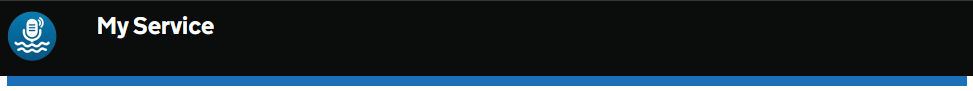
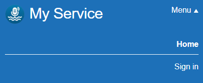

# Header

Render a single GOV.UK Design System styled header component, with optional navigation links.

This is designed to work with the rebranded GDS styles, so your `<html>` element should include the class `govuk-template--rebranded`.

## Example image

### Full size with links


### Small size with open menu


## How it works

- Renders a `<header class="govuk-header">` element styled according to the GOV.UK Design System.
- Displays your logo, service name, and service link.
- The `ServiceName` parameter sets the name of your service. Ideally this should be short as long names can easily break over multiple lines
- The `ServiceUrl` parameter sets the link for the service.
- The `LogoUrl` parameter allows you to use your service logo image.
- Optionally, you can add navigation links using the `NavLinks` fragment and including a list of `GdsHeaderNavLink`s.
- Should be placed in your layout file, above the main content.

## Changing the widths
This component uses the defaults of 1/3rd width for the logo and service name, and 2/3rds width for the navigation links.
If you need to change these widths, you can do so by overriding the CSS variables in your own stylesheet, for example:
```css
.govuk-header__content {
    @include govuk-media-query($from: desktop) {
        width: 47%;
    }
}

.govuk-header__logo {
    @include govuk-media-query($from: desktop) {
        width: 53%;
    }
}
```

## Notes
This component is intentionally restrictive. If you need more control over the header layout, consider creating your own header component using standard HTML and CSS.

## Example without links

```html
<body class="govuk-template__body">
  <GdsHeader ServiceName="My Service" ServiceUrl="home" LogoUrl="@Assets["images/logos/logo.webp"]" />

  <div class="govuk-width-container">
    <main class="govuk-main-wrapper govuk-body" id="main-content" role="main">
      @Body
    </main>
  </div>

  <GdsFooter />
</body>
```

## Example with links
Use the `GdsHeaderNavLink` component to add navigation links within the `NavLinks` parameter. In this example, we also use the `AuthorizeView` component to conditionally show "Sign in" or "Sign out" links based on the user's authentication status.

This works similar to how Blazor NavLink components function, with the `Href` parameter specifying the link URL and the `Match` parameter determining how the active state is applied.
```html
<body class="govuk-template__body">
    <GdsHeader ServiceName="My Service" ServiceUrl="home" LogoUrl="@Assets["images/logos/logo.webp"]">
        <NavLinks>
            <GdsHeaderNavLink Href="" Match="NavLinkMatch.All">Home</GdsHeaderNavLink>
            <AuthorizeView>
                <Authorized>
                    <GdsHeaderNavLink Href="signout" Match="NavLinkMatch.All">Sign out</GdsHeaderNavLink>
                </Authorized>
                <NotAuthorized>
                    <GdsHeaderNavLink Href="signin" Match="NavLinkMatch.All">Sign in</GdsHeaderNavLink>
                </NotAuthorized>
            </AuthorizeView>
        </NavLinks>
    </GdsHeader>
  <div class="govuk-width-container">
    <main class="govuk-main-wrapper govuk-body" id="main-content" role="main">
      @Body
    </main>
  </div>

  <GdsFooter />
</body>
