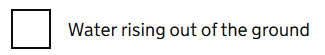

# Input checkbox

Render a GOV.UK Design System styled checkbox form control.

## Example image



## How it works

- Renders `<input type="checkbox">` styled according to GOV.UK Design System.
- Wraps Blazor's `InputCheckbox` component.
- `Id` optional parameter to set the `id` attribute of the component. If no `Id` is provided, Blazor's `InputCheckbox` bound field name will be used.
- `Name` optional parameter to set the `name` attribute of the component. If no `Name` is provided, `GdsCheckboxes` `Name` parameter will be used, otherwise Blazor's `InputCheckbox` name attribute will be used.
- `Exclusive` optional parameter to set the `data-behaviour` attribute of the component.
- `ConditionalId` optional parameter to set the `data-aria-controls` attribute of the component. Also use the `GdsCheckboxConditional` component.
- `OnChanged` optional parameter to have a callback for when the checkbox value changes. The new value is passed as a parameter to the callback.

Must be placed within `GdsCheckboxItem` otherwise it won't render correctly.

To fully support error handling and accessibility place the `GdsInputCheckbox` component within a `GdsFormGroup`, `GdsFieldsetGroup`, `GdsCheckboxes` and `GdsCheckboxItem`.

Other checkbox components:
- GdsCheckboxes
- GdsCheckboxConditional
- GdsCheckboxDivider
- GdsCheckboxHint
- GdsCheckboxItem
- GdsCheckboxLabel

## Notes

This page explains the current version of the component, which is `GdsInputCheckbox`.

`GdsCheckbox` is deprecated in v3.5.0! It will be removed in future versions.

If you still use the `GdsCheckbox` component see [GdsCheckbox](Checkbox.md).

## Examples

For more examples of how to use the `GdsInputCheckbox` component, see the [GdsCheckboxes](Checkboxes.md).

## Simple checkboxes

```razor
<GdsFormGroup>
    <GdsFieldsetGroup>
        <GdsFieldsetLegend>
            <GdsFieldsetHeading Level="2">What is your nationality?</GdsFieldsetHeading>
        </GdsFieldsetLegend>

        <GdsHint>If you have dual nationality, select all options that are relevant to you</GdsHint>
        <GdsErrorMessage />

        <GdsCheckboxes>
            <GdsCheckboxItem>
                <GdsInputCheckbox @bind-Value="model.IsBritish" />
                <GdsCheckboxLabel Text="British" />
                <GdsCheckboxHint>including English, Scottish, Welsh and Northern Irish</GdsCheckboxHint>
            </GdsCheckboxItem>

            <GdsCheckboxItem>
                <GdsInputCheckbox @bind-Value="model.IsIrish" />
                <GdsCheckboxLabel Text="Irish" />
            </GdsCheckboxItem>

            <GdsCheckboxItem>
                <GdsInputCheckbox @bind-Value="model.IsOther" />
                <GdsCheckboxLabel Text="Citizen of another country" />
            </GdsCheckboxItem>
        </GdsCheckboxes>
    </GdsFieldsetGroup>
</GdsFormGroup>

@code {
    private CheckboxesModel model = new();
    private EditContext? editContext;

    protected override void OnInitialized()
    {
        if (editContext is null)
        {
            editContext = new(model);
            editContext.SetFieldCssClassProvider(new GdsFieldCssClassProvider());
        }
    }

    public class CheckboxesModel
    {
        [GdsFieldErrorClass(GdsFieldTypes.Checkbox)]
        public bool IsBritish { get; set; }

        [GdsFieldErrorClass(GdsFieldTypes.Checkbox)]
        public bool IsIrish { get; set; }

        [GdsFieldErrorClass(GdsFieldTypes.Checkbox)]
        public bool IsOther { get; set; }
    }
}
```
