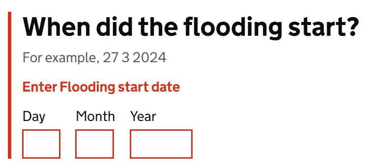

# Input Date

Render a single GOV.UK Design System styled date input using the [GdsDate](GdsDate.md) model.

Users can enter any values for the day, month, and year fields, conversion to the final date is handled by the [GdsDate](GdsDate.md) model.

## Example image



## How it works

- Renders three `<input type="text">` fields for day, month, and year, styled according to GOV.UK Design System.
- Requires binding to a property of type [GdsDate](GdsDate.md) via the `For` parameter.
- Integrates with Blazor's validation system, allowing it to show errors for invalid or incomplete dates.
- Shows the highest priority error message if multiple validation errors exist. 
- The components `Id` is either calculated for the field or manually set via the `Id` parameter.
- Supports additional parameters such as `IsDateOfBirth`, `Heading`, and `Hint` for customization and accessibility.

## Validating the date

You can validate the date any way you choose. We have built a series of FluentValidation validators to make validating the `GdsDate` model easier.

It also makes it easier to follow the GOV.UK Design System guidance on validating dates.
- If nothing is entered
- If the date is incomplete
- If the date entered cannot be correct

These are all the validators we provide:
- DayMonthYearNotEmptyValidator
- GdsDateDayValidators
  - DayNotEmpty
  - DayMustBeNumber
  - DayInclusiveBetween
  - CorrectDaysInMonth
- GdsDateMonthValidators
  - MonthNotEmpty
  - MonthMustBeNumber
  - MonthInclusiveBetween
- GdsDateValidators
  - DayMonthYearNotEmpty
  - IsRealDate
- GdsDateYearValidators
  - YearNotEmpty
  - YearMustBeNumber
  - YearInclusiveBetween
- IsRealDateValidator

## Example validation

```
RuleFor(o => o.StartDate)
    .Cascade(CascadeMode.Stop)
    .DayMonthYearNotEmpty()
    .DayMustBeNumber()
    .MonthMustBeNumber()
    .YearMustBeNumber()
    .DayInclusiveBetween(1, 31)
    .MonthInclusiveBetween(1, 12)
    .YearInclusiveBetween(1900, DateTimeOffset.UtcNow.Year + 1)
    .CorrectDaysInMonth()
    .IsRealDate()
    .WithName("Flooding start date");
```

## Simple example

```
<GdsInputDate For="() => Model.StartDate" />
```

## Example with explicit Id

```
<GdsInputDate For="() => Model.StartDate" Id="flood-start" />
```

## Example using optional Heading and hint

```
<GdsInputDate For="() => Model.StartDate" Id="flood-start">
    <Heading>
        <h1 class="govuk-fieldset__heading">When did the flooding start?</h1>
    </Heading>
    <Hint>For example, 27 3 2025</Hint>
</GdsInputDate>
```

# Example using date of birth

```
<GdsInputDate For="() => Model.DateOfBirth" Id="dob" IsDateOfBirth="true">
    <Heading>
        <h1 class="govuk-fieldset__heading">What is your date of birth?</h1>
    </Heading>
    <Hint>For example, 27 3 1980</Hint>
</GdsInputDate>
```
