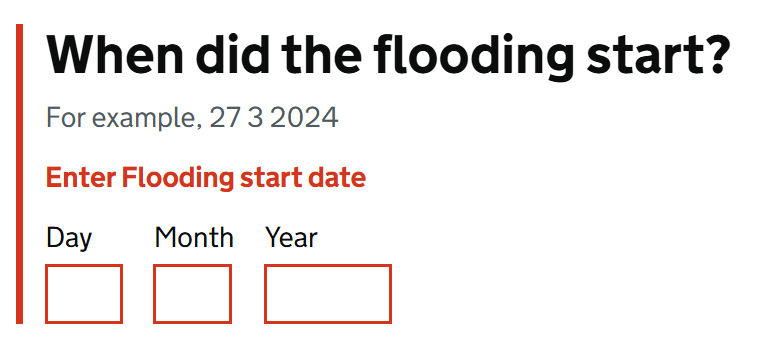

# Input Date

Render a single GOV.UK Design System styled date input using the [GdsDate](GdsDate.md) model.

Users can enter any values for the day, month, and year fields, conversion to the final date is handled by the [GdsDate](GdsDate.md) model.

## Example image



## How it works

- Renders three `<input type="text">` fields for day, month, and year, styled according to GOV.UK Design System.
- Requires binding to a property of type [GdsDate](GdsDate.md) via the `For` parameter.
- Integrates with Blazor's validation system, allowing it to show errors for invalid or incomplete dates.
- `Id` optional parameter to set the `id` attribute of the component. If no `Id` is provided, a unique `id` will be generated.
- `IsDateOfBirth` optional parameter which will correctly set the autocomplete attribute.
- `Heading` optional parameter to set the content used with the fieldset heading. Recommended to use `GdsFieldsetHeading`.
- `Hint` optional parameter to set the content used for the dates hint.
- Must be placed within `GdsFormGroup` to fully support error handling and accessibility.

## Simple example

```razor
<GdsFormGroup>
    <GdsInputDate For="() => model.StartDate" />
</GdsFormGroup>
```

## Example with explicit Id

```razor
<GdsFormGroup>
    <GdsInputDate For="() => Model.StartDate" Id="flood-start" />
</GdsFormGroup>
```

## Example with optional Heading, Hint, and IsDateOfBirth

```razor
<GdsFormGroup>
    <GdsInputDate For="() => Model.DateOfBirth" IsDateOfBirth>
        <Heading>
            <GdsFieldsetHeading Level="2">What is your date of birth?</GdsFieldsetHeading>
        </Heading>
        <Hint>For example, 27 3 1980</Hint>
    </GdsInputDate>
</GdsFormGroup>
```

# Validation

You can validate the date any way you choose. We have built a series of FluentValidation validators to make validating the `GdsDate` model easier.

It also makes it easier to follow the GOV.UK Design System guidance on validating dates.
- If nothing is entered
- If the date is incomplete
- If the date entered cannot be correct

These are all the validators we provide:
- DayMonthYearNotEmptyValidator
- GdsDateDayValidators
  - DayNotEmpty
  - DayMustBeNumber
  - DayInclusiveBetween
  - CorrectDaysInMonth
- GdsDateMonthValidators
  - MonthNotEmpty
  - MonthMustBeNumber
  - MonthInclusiveBetween
- GdsDateValidators
  - DayMonthYearNotEmpty
  - IsRealDate
- GdsDateYearValidators
  - YearNotEmpty
  - YearMustBeNumber
  - YearInclusiveBetween
- IsRealDateValidator

## Example manual validation

```csharp
private void OnSubmit()
{
    messageStore.Clear();

    if (editContext.Validate())
    {
        // basic date of birth, day validation
        FieldIdentifier dobDay = FieldIdentifier.Create(() => model.DateOfBirth.DayText);
        if (model.DateOfBirth.DayText is null)
        {
            messageStore.Add(dobDay, "Enter the day");
            editContext.NotifyValidationStateChanged();
            return;
        }
        if (model.DateOfBirth.Day is null)
        {
            messageStore.Add(dobDay, "Day must be number");
            editContext.NotifyValidationStateChanged();
            return;
        }
        if (model.DateOfBirth.Day < 1 || model.DateOfBirth.Day > 31)
        {
            messageStore.Add(dobDay, "Day must be between 1 and 31");
            editContext.NotifyValidationStateChanged();
            return;
        }

        ... 

        // month validation
        // year validation
        // full date validation
    }
}
```

## Example Fluent validation

```csharp
RuleFor(o => o.StartDate)
    .Cascade(CascadeMode.Stop)
    .DayMonthYearNotEmpty()
    .DayMustBeNumber()
    .MonthMustBeNumber()
    .YearMustBeNumber()
    .DayInclusiveBetween(1, 31)
    .MonthInclusiveBetween(1, 12)
    .YearInclusiveBetween(1900, DateTimeOffset.UtcNow.Year + 1)
    .CorrectDaysInMonth()
    .IsRealDate()
    .WithName("Flooding start date");
```