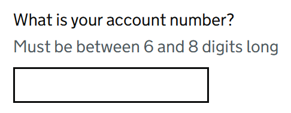
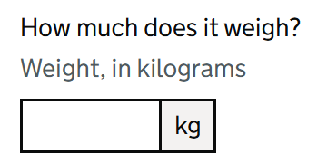

# Input Number

Render a GOV.UK Design System styled text form control which validates numbers.

The GOV.UK Design System defines two types: "Asking for whole numbers" and "Asking for decimal numbers". This component can be used for both types. Both use ```<input type="text">``` with whole numbers setting `inputmode` to `numeric`.

## Example images





## How it works

- Renders a ```<input class="govuk-input" type="text">``` form control for numbers.
- The `id` attribute can be set with the `Id` property. If omitted, it falls back to a cascaded id provided by `GdsFormGroup`.
- Supports whole numbers as `int?` or decimal numbers as `float?` via two-way binding.
- The component automatically sets the `spellcheck` attribute to `false`.
- In all other ways it behaves just like Blazor's built-in `InputText` component.
- It is recommended to use this component within a [GdsFormGroup](FormGroup.md).

## Example model

```csharp
public class ExampleModel
{
    public string? AccountNumberText { get; set; }
    public int? AccountNumber { get; set; }
    public string? WeightText { get; set; }
    public float? Weight { get; set; }
}
```

## Whole number example

```csharp
<GdsFormGroup For="() => Model.AccountNumberText" Id="account-number">
    <GdsLabel Text="What is your account number?" />
    <GdsHint>Must be between 6 and 8 digits long</GdsHint>
    <GdsErrorMessage />
    <GdsInputNumber @bind-Value=Model.AccountNumberText @bind-WholeNumber=Model.AccountNumber class="govuk-input govuk-input--width-10" />
</GdsFormGroup>
```

## Decimal number example

```csharp
<GdsFormGroup For="() => Model.WeightText" Id="weight">
    <GdsLabel Text="How much does it weigh?" />
    <GdsHint>Weight, in kilograms</GdsHint>
    <GdsErrorMessage />
    <div class="govuk-input__wrapper">
        <GdsInputNumber @bind-Value=Model.WeightText @bind-FloatNumber=Model.Weight class="govuk-input govuk-input--width-5" />
        <div class="govuk-input__suffix" aria-hidden="true">kg</div>
    </div>
</GdsFormGroup>
```