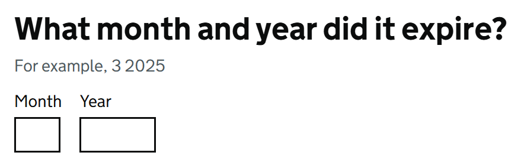

# Input Partial Date

Render part of GOV.UK Design System styled date input; or an approximate date; using the [GdsDate](GdsDate.md) model.

This component allows users to enter incomplete dates, such as only the year, or month and year, when the exact date is unknown.

## Example image



## How it works

- Renders three `<input type="text">` fields for any combination of day, month, or year, styled according to GOV.UK Design System.
- Requires binding to a property of type [GdsDate](GdsDate.md) via the `For` parameter.
- Integrates with Blazor's validation system, allowing it to show errors for invalid or incomplete dates.
- Shows the highest priority error message if multiple validation errors exist. 
- The components `Id` is either calculated for the field or manually set via the `Id` parameter.
- Supports additional parameters such as `IsDateOfBirth`, `Heading`, and `Hint` for customization and accessibility.

You can optionally choose to populate the `DayText`, `MonthText`, and `YearText` fields based on your requirements.

You can optionally choose to show or hide any combination of day, month, and year fields using the `ShowDay`, `ShowMonth`, and `ShowYear` parameters.

For example you could set 01 into the `DayText` field, set `ShowMonth` and `ShowYear` to `true` for the user to complete. This would result in a valid date in the `DateUtc` property of the bound `GdsDate` model.

## Use cases for partial dates

Partial dates are useful when only part of a date is known, such as:
- Year of birth for historical records
- Month and year of an event when the exact day is unknown
- Expiry dates for documents or memberships

## Validating the date

Please see [InputDate.md](InputDate.md#validating-the-date) for more information on validating dates.

## Simple example - With month and year

```csharp
<GdsInputPartialDate For="() => Model.ExpiryDate" ShowMonth="true" ShowYear="true" />
```

## Example with explicit Id

```csharp
<GdsInputPartialDate For="() => Model.ExpiryDate" ShowMonth="true" ShowYear="true" Id="expiry" />
```

## Example using optional Heading and hint

```csharp
<GdsInputPartialDate For="() => Model.ExpiryDate" ShowMonth="true" ShowYear="true" Id="expiry">
    <Heading>
        <h1 class="govuk-fieldset__heading">What month and year did it expire?</h1>
    </Heading>
    <Hint>For example, 3 2025</Hint>
</GdsInputPartialDate>
```

# Example using date of birth

```csharp
<GdsInputPartialDate For="() => Model.ApproxDateOfBirth" Id="dob" IsDateOfBirth="true" ShowMonth="true" ShowYear="true">
    <Heading>
        <h1 class="govuk-fieldset__heading">What month and year were you born?</h1>
    </Heading>
    <Hint>For example, 3 1980</Hint>
</GdsInputPartialDate>
```

## Example using Heading, Hint, and Year

```csharp
<GdsInputPartialDate For="() => Model.EstimatedYear" ShowYear="true">
    <Heading>
        <h1 class="govuk-fieldset__heading">Which year did the event occur?</h1>
    </Heading>
    <Hint>For example, 2025</Hint>
</GdsInputPartialDate>
```