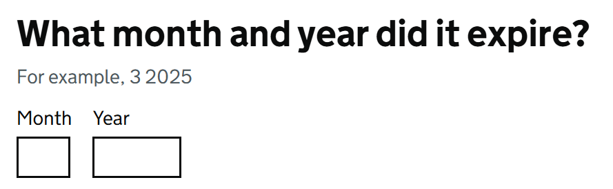

# Input Partial Date

Render part of GOV.UK Design System styled date input using the [GdsDate](GdsDate.md) model.

This component allows users to enter incomplete dates, such as only the year, or month and year, when the exact date is unknown.

## Example image



## How it works

- Renders three `<input type="text">` fields for any combination of day, month, or year, styled according to GOV.UK Design System.
- Requires binding to a property of type [GdsDate](GdsDate.md) via the `For` parameter.
- Integrates with Blazor's validation system, allowing it to show errors for invalid or incomplete dates.
- `Id` optional parameter to set the `id` attribute of the component. If no `Id` is provided, a unique `id` will be generated.
- `IsDateOfBirth` optional parameter which will correctly set the autocomplete attribute.
- `Heading` optional parameter to set the content used with the fieldset heading. Recommended to use `GdsFieldsetHeading`.
- `Hint` optional parameter to set the content used for the dates hint.
- Must be placed within `GdsFormGroup` to fully support error handling and accessibility.
- `ShowDay` parameter to show or hide the day field.
- `ShowMonth` parameter to show or hide the month field.
- `ShowYear` parameter to show or hide the year field.

You can optionally choose to populate the `DayText`, `MonthText`, and `YearText` fields based on your requirements.

For example you could set 01 into the `DayText` field, set `ShowMonth` and `ShowYear` to `true` for the user to complete.
This would result in a valid date in the `DateUtc` property of the bound `GdsDate` model.

## Use cases for partial dates

Partial dates are useful when only part of a date is known, such as:
- Year of birth for historical records
- Month and year of an event when the exact day is unknown
- Expiry dates for documents or memberships

## Validating the date

Please see [InputDate.md](InputDate.md#Validation) for more information on validating dates.

## Simple example - With month and year

```razor
<GdsFormGroup>
    <GdsInputPartialDate For="() => Model.ExpiryDate" ShowMonth ShowYear />
</GdsFormGroup>
```

## Example with explicit Id

```razor
<GdsFormGroup>
    <GdsInputPartialDate For="() => Model.ExpiryDate" ShowMonth ShowYear Id="expiry" />
</GdsFormGroup>
```

## Example using optional Heading, Hint, and IsDateOfBirth

```razor
<GdsFormGroup>
    <GdsInputPartialDate For="() => Model.ApproxDateOfBirth" ShowMonth ShowYear IsDateOfBirth>
        <Heading>
            <GdsFieldsetHeading Level="2">What month and year were you born?</GdsFieldsetHeading>
        </Heading>
        <Hint>For example, 3 1980</Hint>
    </GdsInputPartialDate>
</GdsFormGroup>
```
