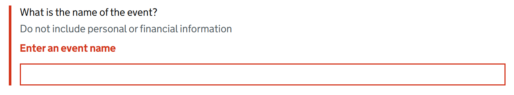

# Input Text

Render a GOV.UK Design System styled text form control.

## Example image



## How it works

- Renders a ```<input class="govuk-input" type="text">``` form control.
- The `id` attribute can be set with the `Id` property. If omitted, it falls back to a cascaded id provided by `GdsFormGroup`.
- It behaves just like Blazor's built-in `InputText` component.
- It is recommended to use this component within a [GdsFormGroup](FormGroup.md).

## Simple example with explicit `id`

```csharp
<GdsInputText Id="event-name" @bind-Value=Model.EventName class="govuk-input govuk-input--width-50" />
```

## Example using a cascaded id

```csharp
<GdsFormGroup For="() => Model.EventName">
    <GdsLabel Text="What is the name of the event?" />
    <GdsHint>Do not include personal or financial information</GdsHint>
    <GdsErrorMessage />
    <GdsInputText @bind-Value=Model.EventName class="govuk-input govuk-input--width-50" />
</GdsFormGroup>
```