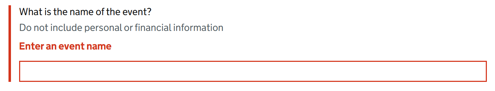

# Input Text

Render a GOV.UK Design System styled text form control.

## Example image



## How it works

- Renders a ```<input class="govuk-input" type="text">``` form control.
- It behaves just like Blazor's built-in `InputText` component.
- It is recommended to use this component within a [GdsFormGroup](FormGroup.md).
- The `Id` attribute is optional, letting you choose your own hint id.
- If `Id` is not set, and used within `GdsFormGroup`, a default hint id is generated.

## Example

```csharp
<GdsFormGroup>
    <GdsLabel Text="What is the name of the event?" />
    <GdsHint>Do not include personal or financial information</GdsHint>
    <GdsErrorMessage />
    <GdsInputText @bind-Value=Model.EventName class="govuk-input govuk-input--width-50" />
</GdsFormGroup>
```

## Example without hint or error message

```csharp
<GdsFormGroup>
    <GdsLabel Text="What is the name of the event?" />
    <GdsInputText @bind-Value=Model.EventName class="govuk-input govuk-input--width-50" />
</GdsFormGroup>
```
