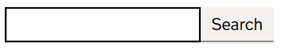

# Input Text Search

This component renders an inline search box using GOV.UK Design System styled controls.

> [!WARNING]
> This is a proposal component in testing by Dorset Council. 
> The implementation is not documented or recommended by GDS and may require further accessibility testing.
> Not recommended for public facing applications. 

## Example image



## How it works

- Renders a `govuk-input__wrapper` element containing a GdsInputText and GdsButton control.
- The `id` attribute can be set with the `Id` property. If omitted, it falls back to a cascaded id provided by `GdsFormGroup`.
- You can use the `OnClick` event callback to trigger actions when the button is clicked.
- The `InputWidth` parameter allows you to control the width of the input element. 

## Simple example with explicit `id`

```csharp
<GdsInputTextSearch Id="event-name" />
```

## Example with callback

```csharp
<GdsInputTextSearch @bind-Value="_SearchTerm" OnClick="@OnSearchClick" />
```
