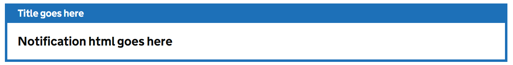

# Header

Render a single GOV.UK Design System styled notification banner component.

## Example image



## How it works

- Renders a GDS notification banner
- If you select `BannerSizeOption.small` the header will be set to `h3`
- Selecting `BannerSizeOption.large` will set the header to `h2`
- The `NotificationTypeOption` can be `info` or `success` and will configure the panel to blue or green.
- The role of the component is automatically configured based on the option selected above

## Notes

We are currently using an older style of header component. We are planning to update to their June 2025 refreshed branding soon.

## Example

```html
<GdsNotificationBanner NotificationType="GdsNotificationBanner.NotificationTypeOption.info"
                       BannerTitleSize="GdsNotificationBanner.BannerSizeOption.small"
                       BannerTitle="Title goes here">
    Notification html goes here
</GdsNotificationBanner>
```