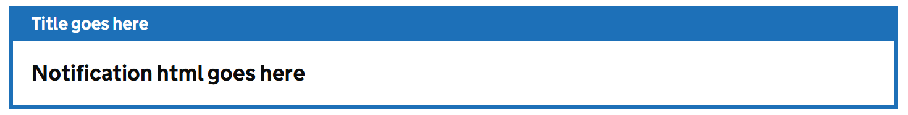

# Header

Render a single GOV.UK Design System styled notification banner component.

## Example image



## How it works

- Renders `<div class="govuk-notification-banner">` element styled according to the GOV.UK Design System.
- `Id` optional parameter to set the `id` attribute of the component. If no `Id` is provided, a unique `id` will be generated.
- `NotificationType` parameter can be `info` or `success` and will configure the panel colour.
- `BannerTitle` parameter sets the title of the notification banner.
- `BannerHeadingLevel` parameter sets the heading level of the title. Default is `2`.

## Example

```razor
<GdsNotificationBanner NotificationType="GdsNotificationBanner.NotificationTypeOption.info"
                       BannerHeadingLevel="2"
                       BannerTitle="Title goes here">
    <div>Notification content goes here</div>
</GdsNotificationBanner>
```