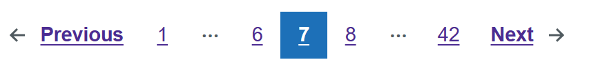
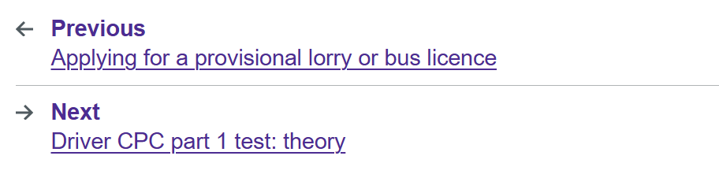

# Pagination

Render a GOV.UK Design System styled pagination component.

The component supports both standard pagination (with page numbers) and block style pagination (previous and next with optional labels).

## Example images





## How it works

- Renders a `<nav class="govuk-pagination">` element with GOV.UK classes.
- Supports page numbers and block style (`govuk-pagination--block`).
- `CurrentPage` and `TotalPages` are required.
- `HrefGenerator` is used for the format of the `href` attribute for each page link. This can be simple or with query parameters.
- `OnPageChanged` can be used to handle pagination in code (for example, loading API results without full Blazor page navigation).

## Simple example

- link navigation
- with query parameters
- Blazor page navigation

```csharp
@inject NavigationManager NavigationManager

<GdsPagination CurrentPage="7" TotalPages="42" HrefGenerator="PageHref" />

@code {
    private string PageHref(int pageNumber)
    {
        return NavigationManager.GetUriWithQueryParameters(new Dictionary<string, object?>
        {
            ["page"] = pageNumber,
        });
    }
}
```

## Event callback example (load data in code)

- no link navigation
- no link generation
- no Blazor page navigation (using `OnPageChanged`)

```csharp
@inject NavigationManager NavigationManager

<GdsPagination CurrentPage="@CurrentPage" TotalPages="@TotalPages" OnPageChanged="OnPageChanged" />

@code {
    private int CurrentPage { get; set; } = 1;
    private int TotalPages { get; set; } = 20;

    private Task OnPageChanged(int pageNumber)
    {
        CurrentPage = pageNumber;

        // Call your API / reload your data here
        return Task.CompletedTask;
    }
}
```

## Block style example

- block style
- no page numbers
- labels under previous and next
- no Blazor page navigation (using `OnPageChanged`)

```csharp
@inject NavigationManager NavigationManager

<GdsPagination CurrentPage="@CurrentPage"
               TotalPages="@TotalPages"
               OnPageChanged="OnPageChanged"
               PreviousLabel="@($"A previous page (goto page {_model.CurrentPage - 1})")"
               NextLabel="@($"A next page (goto page {_model.CurrentPage + 1})")"
               BlockStyle />

@code {
    private int CurrentPage { get; set; } = 1;
    private int TotalPages { get; set; } = 42;

    private Task OnPageChanged(int pageNumber)
    {
        CurrentPage = pageNumber;

        // Call your API / reload your data here
        return Task.CompletedTask;
    }
}
```