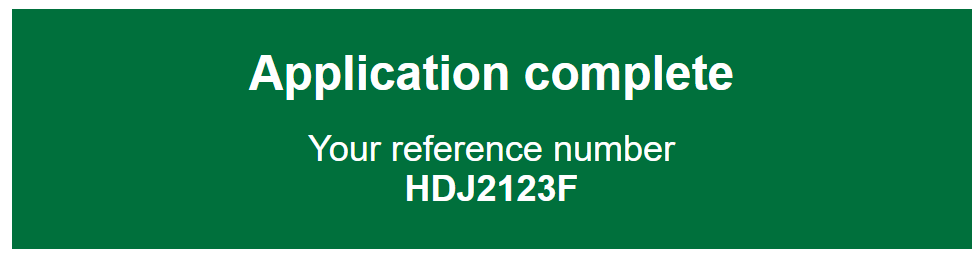

# Panel

Render a single GOV.UK Design System styled panel component.

## Example image



## How it works

- Renders a GDS panel
- Displays title using the `Title` parameter.
- Displays body content using `ChildContent`.

## Example

```razor
<GdsPanel Title="Application complete">
	Your reference number<br><strong>HDJ2123F</strong>
</GdsPanel>
```

```razor
<GdsPanel Title="Is your age correct?" Interruption>
 <ChildContent>
  You entered your age as <strong>109</strong>.
 </ChildContent>
 <Actions>
  <div class="govuk-button-group">
   <GdsButton PreventDoubleClick AdditionalCssClasses="govuk-button--inverse" Text="Yes, this is correct" />
   <GdsLink Href="#" AdditionalCssClasses="govuk-link--inverse">
    No, change my age
   </GdsLink>
   </div>
  </Actions>
</GdsPanel>
```
