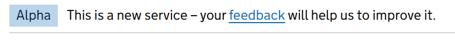

# Phase Banner

Render a single GOV.UK Design System styled phase banner component.

## Example image



## How it works

- Renders a ```<div class="govuk-phase-banner">``` element styled according to the GOV.UK Design System.
- Displays a phase tag (e.g., Alpha, Beta, New) using the `Phase` parameter.
- Optionally displays a feedback link if the `FeedbackLink` parameter is set; otherwise, shows feedback text.
- The `FeedbackText` parameter customizes the feedback prompt text.
- Should be placed in your layout file, above the main content.

## Simple example

```
<GdsPhaseBanner Phase="GdsPhaseBanner.Phases.Alpha" />
```

## Example using feedback link

```
<GdsPhaseBanner Phase="GdsPhaseBanner.Phases.Beta" FeedbackLink="_feedbackUri" />

@code {
    private readonly Uri _feedbackUri = new("https://example.com/feedback");
}
```