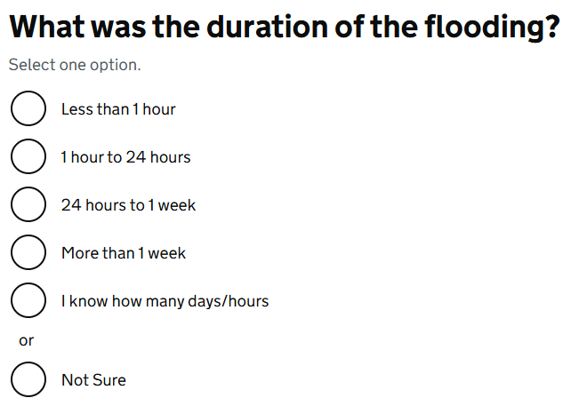

# Radios

Render GOV.UK Design System styled radio buttons using the options from a list of [GdsOptionItem<T>](GdsOptionItem.md). This component supports any type of value and can be used for single selections.

## Example image



## How it works

- Renders `<div class="govuk-radios">` element styled according to the GOV.UK Design System.
- Wraps Blazor's `InputRadioGroup` component.
- `Smaller` parameter to render smaller radio buttons.
- `Inline` parameter to render radio buttons inline.
- It is recommended to use this component within a [GdsFormGroup](FormGroup.md) and [GdsFieldsetGroup](FieldsetGroup.md) to fully support correct HTML and accessibility.

## Example

```razor
<GdsFormGroup>
    <GdsFieldsetGroup>
        <GdsFieldsetLegend Size="GdsSize.Medium">
            <GdsFieldsetHeading Level="3">Where do you live?</GdsFieldsetHeading>
        </GdsFieldsetLegend>

        <GdsHint>Select one option</GdsHint>
        <GdsErrorMessage />

        <GdsRadios @bind-Value="model.Country">
            @foreach ((string countryCode, string countryName) in countries)
            {
                <GdsRadioItem>
                    <GdsInputRadio Value="@countryCode" />
                    <GdsRadioLabel Text="@countryName" />
                </GdsRadioItem>
            }

            <GdsRadioDivider />

            <GdsRadioItem>
                <GdsInputRadio Value="@("OTHER")" />
                <GdsRadioLabel Text="Other" />
                <GdsRadioHint>I live in another country</GdsRadioHint>
            </GdsRadioItem>
        </GdsRadios>
    </GdsFieldsetGroup>
</GdsFormGroup>

@code {
    private KeyValuePair<string, string>[] countries = [
        new("GB-ENG", "England"),
        new("GB-SCT", "Scotland"),
        new("GB-WLS", "Wales"),
        new("GB-NIR", "Northern Ireland"),
    ];

    public class RadiosModel
    {
        [Required(ErrorMessage = "Select where you live")]
        [GdsFieldErrorClass(GdsFieldTypes.Radio)]
        public string? Country { get; set; }
    }
}
```

# Using GDS conditional controls

```razor
<GdsFormGroup>
    <GdsFieldsetGroup>
        <GdsFieldsetLegend Size="GdsSize.Medium">
            <GdsFieldsetHeading Level="3">How would you prefer to be contacted?</GdsFieldsetHeading>
        </GdsFieldsetLegend>

        <GdsHint>Select one option</GdsHint>
        <GdsErrorMessage />

        <GdsRadios @bind-Value="model.ContactPreference">
            <GdsRadioItem>
                <GdsInputRadio Value="@ContactPreferences.Email" ConditionalId="conditional-email" />
                <GdsRadioLabel Text="Email" />
            </GdsRadioItem>
            <GdsRadioConditional Id="conditional-email">
                <GdsFormGroup>
                    <GdsLabel Text="Email address" />
                    <GdsErrorMessage />
                    <GdsInputText @bind-Value="@model.EmailAddress" type="email" spellcheck="false" autocomplete="email" class="govuk-input govuk-!-width-one-third" />
                </GdsFormGroup>
            </GdsRadioConditional>

            <GdsRadioItem>
                <GdsInputRadio Value="@ContactPreferences.Phone" ConditionalId="conditional-phone" />
                <GdsRadioLabel Text="Phone" />
            </GdsRadioItem>
            <GdsRadioConditional Id="conditional-phone">
                <GdsFormGroup>
                    <GdsLabel Text="Phone number" />
                    <GdsErrorMessage />
                    <GdsInputText @bind-Value="@model.PhoneNumber" type="tel" autocomplete="tel" class="govuk-input govuk-!-width-one-third" />
                </GdsFormGroup>
            </GdsRadioConditional>

            <GdsRadioItem>
                <GdsInputRadio Value="@ContactPreferences.Text" ConditionalId="conditional-text" />
                <GdsRadioLabel Text="Text" />
            </GdsRadioItem>
            <GdsRadioConditional Id="conditional-text">
                <GdsFormGroup>
                    <GdsLabel Text="Mobile phone number" />
                    <GdsErrorMessage />
                    <GdsInputText @bind-Value="@model.MobileNumber" type="tel" autocomplete="tel" class="govuk-input govuk-!-width-one-third" />
                </GdsFormGroup>
            </GdsRadioConditional>
        </GdsRadios>
    </GdsFieldsetGroup>
</GdsFormGroup>

@code {
    public enum ContactPreferences
    {
        Unknown,
        Email,
        Phone,
        Text,
    }

    public class RadiosModel
    {
        [Required]
        [Range(typeof(ContactPreferences), nameof(ContactPreferences.Email), nameof(ContactPreferences.Text), ErrorMessage = "Select how you prefer to be contacted")]
        [GdsFieldErrorClass(GdsFieldTypes.Radio)]
        public ContactPreferences? ContactPreference { get; set; } = ContactPreferences.Unknown;

        [Required(ErrorMessage = "Enter your email address")]
        [EmailAddress(ErrorMessage = "Enter a valid email address")]
        [GdsFieldErrorClass(GdsFieldTypes.Input)]
        public string? EmailAddress { get; set; }

        [Required(ErrorMessage = "Enter your email address")]
        [EmailAddress(ErrorMessage = "Enter a valid email address")]
        [GdsFieldErrorClass(GdsFieldTypes.Input)]
        public string? PhoneNumber { get; set; }

        [Required(ErrorMessage = "Enter your email address")]
        [EmailAddress(ErrorMessage = "Enter a valid email address")]
        [GdsFieldErrorClass(GdsFieldTypes.Input)]
        public string? MobileNumber { get; set; }
    }
}
```