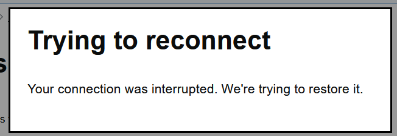
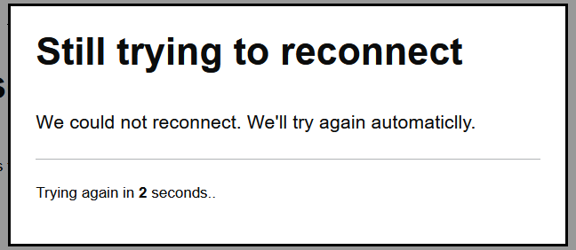

# Blazor Reconnect Model

Render a GOV.UK Design System styled Blazzor Reconnect Model.

## Example image

### First Attempt


### Repeated Attempts


### Reconnect Failed


### Paused


## How it works

- renders the Blazor Recconect Model styled according to the GOV.UK Design System.


## Example - `App.Razor`

```razor
<GdsReconnectModal />
```
