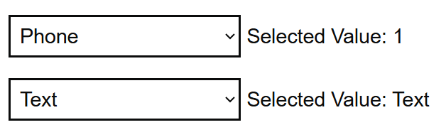

# Select List

Render GOV.UK Design System styled select lists using the options from a list of [GdsOptionItem<T>](GdsOptionItem.md). This component supports any type of value and can be used for single selections.

## Example image



## How it works

- Renders a list of [GdsOptionItem](GdsOptionItem.md) under a ```<select class="govuk-select">```.
- Supports binding to any value type (e.g., string, int, enum, bool, custom types).
- You can use the `OnChange` event callback to trigger actions when the selection changes.
- - The `id` attribute can be set with the `Id` property. If omitted, it falls back to a cascaded id provided by `GdsFormGroup`.

## Simple example

```csharp
ICollection<GdsOptionItem<int>> contactTypes = [
    new ("contactTypeNone", "-- Select --", 0),
    new ("contactTypePhone", "Phone", 1),
    new ("contactTypeEmail", "Email", 2),
    new ("contactTypeText", "Text message", 3),
    new ("contactTypePost", "Post", 4),
];
<GdsSelect Options="@contactTypes" OnChange="@OnContactTypeChange" />
```