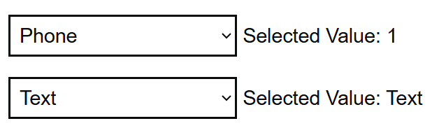

# Select List

Render GOV.UK Design System styled select lists. Option definition is controlled by the calling application.

> [!CAUTION]
> The select component should only be used as a last resort in public-facing services because research shows that some users find selects very difficult to use.

## Example image



## How it works

- Renders a ```<select class="govuk-select">```.
- Bind this component to a property using `@bind-Value` to track and set the selected value.
- The default class is `govuk-select`, but you can use `CssClass` to style the select.
- The `id` attribute is set from the `Id` component property. If omitted, it falls back to a cascaded id provided by `GdsFormGroup`.

## Simple examples

```csharp
<p>
    <GdsSelect @bind-Value="SelectedContactType" T="int">
        @foreach(var value in ContactTypes)
        {
            <option value="@value.Key">@value.Value</option>
        }
    </GdsSelect>

    <span>Selected Value: @SelectedContactType</span>
</p>

<p>
    <GdsSelect @bind-Value="SelectedContactTypeEnum" T="ContactTypeEnum">
        @foreach (var value in Enum.GetValues(typeof(ContactTypeEnum)))
        {
            <option value="@value">@value</option>
        }
    </GdsSelect>

    <span>Selected Value: @SelectedContactTypeEnum</span>
</p>

@code {
    private int SelectedContactType = 1;
    private Dictionary<int, string> ContactTypes = new Dictionary<int, string>
    {
        { 0, "None" },
        { 1, "Phone" },
        { 2, "Email" },
        { 3, "Text" },
        { 4, "Post" }
    };

    private ContactTypeEnum SelectedContactTypeEnum = ContactTypeEnum.Text;
    private enum ContactTypeEnum    
    {
        None,
        Phone,
        Email,
        Text,
        Post
    };
}
```