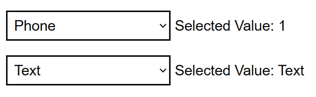

# Select List

Render GOV.UK Design System styled select lists. Option definition is controlled by the calling application.

> [!CAUTION]
> The select component should only be used as a last resort in public-facing services because research shows that some users find selects very difficult to use.

## Example image



## How it works

- Renders a ```<select class="govuk-select">```.
- Bind this component to a property using `@bind-Value` to track and set the selected value.
- The `id` attribute is optional, letting you choose your own form control id.
- If `id` is not set, the form control id stored in the `GdsFormGroup` is used.
- The default class is `govuk-select`, but you can use `CssClass` to style the select.

## Simple examples

```csharp
<GdsFormGroup For="() => model.SelectedContactType">
    <GdsLabel Text="Contact type" />
    <GdsHint>Select the contact type</GdsHint>
    <GdsErrorMessage />
    <GdsSelect @bind-Value="model.SelectedContactType" T="int">
        @foreach(var value in ContactTypes)
        {
            <option value="@value.Key">@value.Value</option>
        }
    </GdsSelect>
    <p>Selected Value: @model.SelectedContactType</p>
</GdsFormGroup>

<GdsFormGroup For="() => model.SelectedContactTypeEnum">
    <GdsLabel Text="Contact type" />
    <GdsHint>Select the contact type</GdsHint>
    <GdsErrorMessage />
    <GdsSelect @bind-Value="model.SelectedContactTypeEnum" T="ContactTypeEnum">
        @foreach (var value in Enum.GetValues(typeof(ContactTypeEnum)))
        {
            <option value="@value">@value</option>
        }
    </GdsSelect>
    <p>Selected Value: @model.SelectedContactTypeEnum</p>
</GdsFormGroup>

@code {
    private Dictionary<int, string> ContactTypes = new Dictionary<int, string>
    {
        { 0, "None" },
        { 1, "Phone" },
        { 2, "Email" },
        { 3, "Text" },
        { 4, "Post" }
    };

    public enum ContactTypeEnum    
    {
        None,
        Phone,
        Email,
        Text,
        Post
    };

    public class SelectModel
    {
        [GdsFieldErrorClass(GdsFieldTypes.Select)]
        public int SelectedContactType { get; set; } = 1;
        
        [GdsFieldErrorClass(GdsFieldTypes.Select)]
        public ContactTypeEnum SelectedContactTypeEnum { get; set; } = ContactTypeEnum.Text;
    }
}
```