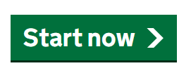

# Button

Render a GOV.UK Design System styled button that can be used to submit forms or trigger actions.

## Example image



## How it works

- Renders a `<a href="#" role="button">` element.
- The `ServiceUrl` parameter sets the `href` attribute to navigate to a URL when clicked. If `ServiceUrl` is not provided, it defaults to `#`.
- Start buttons do not usually submit form data, so use a link tag instead of a button tag.
- This follows the example of the start button on the GOV.UK Design System website.

## Simple example

```csharp
<GdsStartButton />
```

```csharp
<GdsStartButton ServiceUrl="./somepage" />
```

## Notes

- Please use GdsButton for other button implementations.
