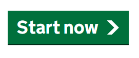

# Start Button

Render a GOV.UK Design System styled start button link that triggers actions.

## Example image



## How it works

- Renders a `<a href="#" role="button">` element.
- The `Text` parameter sets the button text content. The default is "Start now".
- The `Href` parameter sets the URL to navigate to when clicked. If `Href` is not provided, it defaults to `#`.
- Start buttons do not usually submit form data, so use a link tag instead of a button tag.
- This follows the example of the start button on the GOV.UK Design System website.

## Simple example

```csharp
<GdsStartButton />
```

```csharp
<GdsStartButton Text="Sign in" Href="./somepage" />
```

## Notes

- Please use GdsButton for other button implementations.
