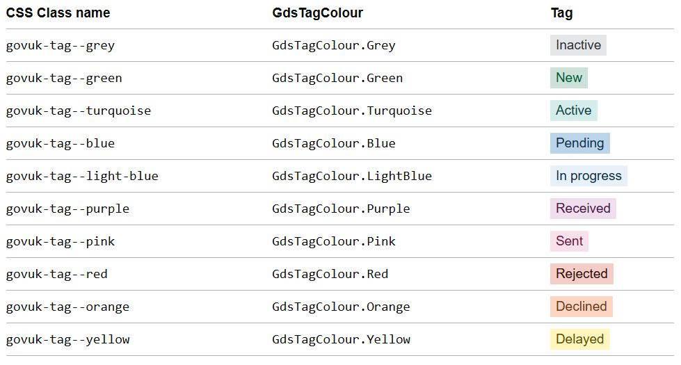

# Tag

Render a GOV.UK Design System styled tag component.

## Example image



## How it works

- Renders a ```<strong class="govuk-tag">``` element styled according to the GOV.UK Design System.
- Displays text using the `Text` parameter.
- Optionally styled using the `Colour` parameter.

## Simple example

```razor
<GdsTag Text="Completed" />
```

## Example using Colour

```razor
<GdsTag Colour="GdsTagColour.Turquoise" Text="Active" />
```