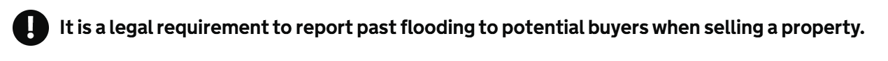

# Warning Text

Render a GOV.UK Design System styled warning text using the `GdsWarning` component.

## Example image



## How it works

- Renders a ```<div class="govuk-warning-text">``` containing a warning icon and message.
- The warning icon text is customizable via the `Icon` parameter (default: "!").
- The warning message is set using the required `Text` parameter.
- Includes a visually hidden "Warning" label for accessibility, as recommended by the GOV.UK Design System.
- Follows GOV.UK Design System styles for clear, accessible warning messages.

## Simple example

```csharp
<GdsWarning Text="Contact information not found" />
```

## Custom icon text example

```csharp
<GdsWarning Text="Are you sure you want to delete this contact" Icon="?" />
```